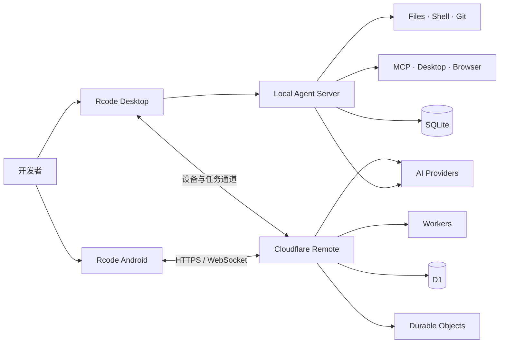

<div align="center">

# ⌁ Rcode

### 本地优先、权限可控的 AI Coding Agent

让 AI 在明确的工作区边界与审批策略内，完成代码理解、文件编辑、测试构建、Git 工作流、桌面操作和跨设备协作。

[](#-运行端)
[](#-运行端)
[](#-快速开始)
[](#-技术栈)

`本地执行` · `逐级审批` · `多模型接入` · `图片生成` · `手机远程` · `MCP 扩展`

</div>

---

## ✦ 项目简介

Rcode 是一个面向真实开发工作的本地 AI Agent 框架。它通过桌面客户端连接 OpenAI-compatible 模型，在项目工作区内调用文件、终端、Git、浏览器与桌面自动化工具，并以 `allow / ask / deny` 权限规则控制操作范围。

项目同时包含 Android 客户端与 Cloudflare 远程服务：电脑在线时，可从手机进入公开的项目和会话继续执行 Agent 任务；电脑离线时，Work 模式仍可通过云端代理聊天或生成图片。

> [!IMPORTANT]
> Rcode 依赖路径校验、命令分析、工具审批和审计记录提供便携式安全边界，但不宣称具备 OS 级沙箱。涉及生产环境、敏感数据或高权限命令时，仍应使用容器、专用账号或隔离主机。

## ◈ 核心能力

| 模块 | 能力 |
| --- | --- |
| 🤖 Agent 工作流 | SSE 实时呈现准备、规划、检查、执行、审批与完成阶段；支持仅规划后确认执行 |
| 🧰 本地工具 | 文件读写、文本搜索、Patch、测试构建、长期进程、网页读取、Git 与项目诊断 |
| 🛡️ 权限系统 | `allow / ask / deny` 规则、工作区边界、强制审批、敏感路径保护与审计记录 |
| 🧠 上下文管理 | 加载 `AGENTS.md`、项目规则、Skills 与记忆；长会话自动压缩并保持工具调用链完整 |
| 🔌 模型与 MCP | 多 OpenAI-compatible 接口、模型发现、思考强度切换及 MCP 工具动态接入 |
| 🎨 图片生成 | 桌面端与手机端图片模式；支持图片模型选择、生成预览和本地文件保存 |
| 🖥️ 桌面控制 | 通过 `native-devtools-mcp` 使用 Accessibility、截图/OCR 和 Chrome/Electron CDP |
| 📱 跨设备协作 | Android 聊天、设备发现、项目/会话选择、远程任务、实时事件和单次审批 |
| ☁️ 远程服务 | Cloudflare Workers + D1 + Durable Objects 提供账号、加密 AI 配置与 WebSocket 中继 |
| ♻️ 自动学习 | 从已验证结果中沉淀可复用经验，并通过去重记录注入后续项目上下文 |

## ⌘ 系统结构



## ▣ 运行端

| 运行端 | 主要目录 | 开发 | 构建 / 验证 |
| --- | --- | --- | --- |
| 电脑客户端 | `src/`、`electron/`、`cli/` | `npm run desktop:dev` | `npm run desktop:build` |
| 本地 Agent 服务 | `server/` | `npm run server:dev` | `npm run server:test` |
| Android 客户端 | `Rcode_apk/` | `npm run mobile:dev` | `npm run mobile:build` / `npm run mobile:apk` |
| 云端账号与远程服务 | `Fwq/` | `npm run remote:dev` | `npm run remote:check` / `npm run remote:test` |

## ▶ 快速开始

### 环境要求

- Node.js 20+
- npm
- macOS 桌面客户端开发环境
- Android Studio（仅构建 Android APK 时需要）

### 启动桌面开发环境

```bash
npm install
cp .env.example .env
npm run desktop:dev
```

Vite 默认地址通常为 `http://localhost:5173`。

### 配置 AI 接口

后端兼容 Chat Completions 与 Images 风格的 OpenAI-compatible API：

```env
AI_API_KEY=your_api_key
AI_BASE_URL=https://api.openai.com/v1
AI_MODEL=gpt-4.1-mini
```

也可以在应用设置中维护多个接口、发现模型、选择默认文本/图片模型，并配置不同思考强度。API Key 应只保存在本机环境或应用安全配置中，不要提交到版本库。

### 常用验证命令

```bash
npm test                 # 本地 Agent 服务测试
npm run build            # 桌面 Web 构建
npm run mobile:build     # Android Web 资源构建
npm run remote:test      # Cloudflare 远程服务测试
```

## 🧠 双层记忆

设置 → 记忆中可以分别配置两层上下文：

- **短时记忆**：按 token 预算保留最近完整对话轮次，把较早内容压缩为本地摘要，并限制超长工具输出。
- **长期记忆**：以项目路径隔离保存到本机 SQLite，按关键词相关性、重要度和时效召回；支持过期时间、去重和敏感凭据拦截。

内置 `memory-management` Skill 提供统一适配约定。其他开源 Memory Skill 也可把持久化操作委托给 `memory_search`、`memory_store` 和 `memory_forget`，无需直接依赖 Rcode 的数据库结构。关闭“Skill 适配”后，这三个工具不会暴露给模型。

## ⚙ 长期进程会话

开发服务器、文件监听器等不会自行退出的命令由 Rcode 托管，无需添加 `&` 或 `nohup`：

- `start_process`：启动长期进程并返回会话 ID、PID 和启动输出。
- `read_process`：读取当前状态和最近输出。
- `write_process`：向进程标准输入发送内容。
- `stop_process`：停止进程及其子进程树。
- `list_processes`：列出当前项目的托管进程。

聊天输入框的“终端”入口可查看状态、PID、命令与输出。Rcode 服务退出时会清理仍在运行的托管进程，不会在重启后自动恢复旧命令。

## ◉ macOS 桌面控制

Rcode 可连接本地 `native-devtools-mcp`，读取和操作 macOS 应用界面：

```bash
npm install -g native-devtools-mcp@0.10.1
native-devtools-mcp setup
```

在 MCP 设置中使用可执行文件的绝对路径添加 stdio 服务，并在“系统设置 → 隐私与安全性”中按需授权：

- **屏幕录制**：截图与 OCR。
- **辅助功能**：点击、输入、滚动、拖动和 Accessibility 元素操作。

建议保持修改界面的操作为 `ask`。Agent 会优先采用不移动鼠标的 Accessibility 操作，并在界面发生变化后重新观察。

## 🔐 权限与安全

Rcode 采用“工作区边界 + 工具审批 + 审计记录”的分层策略：

- 项目内读取、编辑、搜索、测试和构建可按策略自动执行。
- 安装依赖、联网、迁移与容器修改会在执行前展示。
- Git 提交/推送、部署和云资源修改必须确认。
- 数据删除、生产操作及提权命令逐次确认。
- `.env*`、SSH 私钥、钥匙串和浏览器登录数据库等敏感目标默认禁止。
- 密钥通过允许列表引用注入，不进入工具参数，输出中的实际值会被脱敏。

完整规则与安全边界参见 [能力与权限基线](docs/capabilities-and-permissions.md)。

## ☁ 账号与远程协作

`Fwq/` 提供 Cloudflare Workers 远程服务：

- 注册、登录、会话恢复与退出。
- D1 保存账号、会话、设备、任务和加密后的 AI 接口配置。
- Durable Objects 协调同一账号下的实时设备连接。
- 一次性 WebSocket ticket 和账号级房间隔离。
- Work 模式在电脑离线时代理聊天与图片生成。
- Code 模式仅访问电脑主动公开的项目 ID，不接受手机端传入任意本机路径。

详细 API、部署方式与安全设计见 [`Fwq/README.md`](Fwq/README.md)；Android 能力与构建说明见 [`Rcode_apk/README.md`](Rcode_apk/README.md)。

## ⧉ 技术栈

- **桌面与 Web：** Electron、React 19、Vite、TypeScript
- **本地服务：** Node.js、Express、SQLite
- **移动端：** React、Capacitor、Android
- **云端：** Cloudflare Workers、D1、Durable Objects
- **协议与扩展：** SSE、WebSocket、MCP、OpenAI-compatible APIs

## ◇ 项目目录

```text
Rcode/
├── src/                 # 桌面端 React 界面
├── electron/            # Electron 主进程与安全存储
├── server/              # 本地 Agent、工具、权限与状态服务
├── cli/                 # 命令行入口
├── config/              # Agent 与模型供应商配置
├── docs/                # 能力、权限和设计文档
├── Rcode_apk/           # Android 客户端
└── Fwq/                 # Cloudflare 账号与远程服务
```

---

<div align="center">

**Rcode · Code locally, approve explicitly, collaborate anywhere.**

</div>
